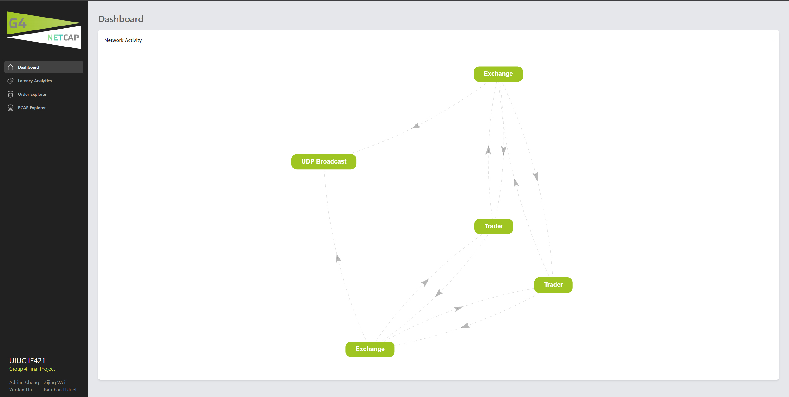
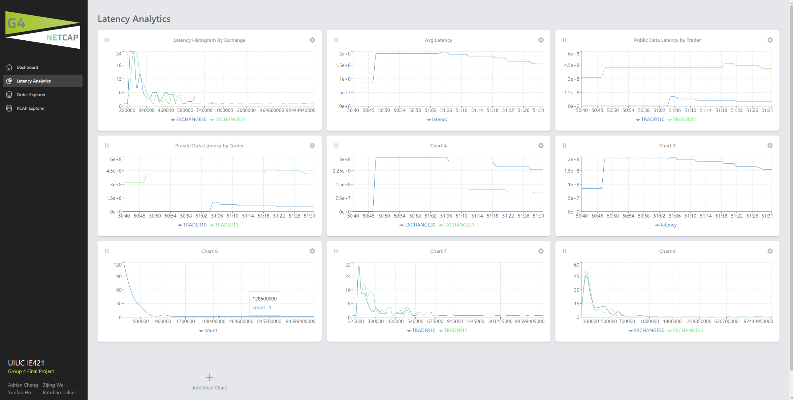
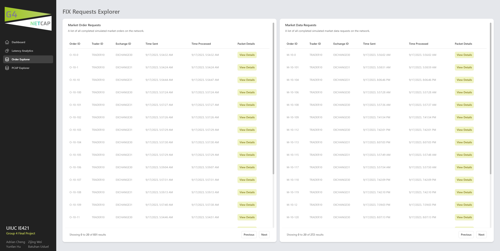
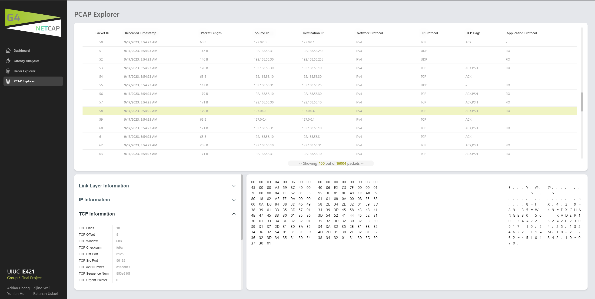
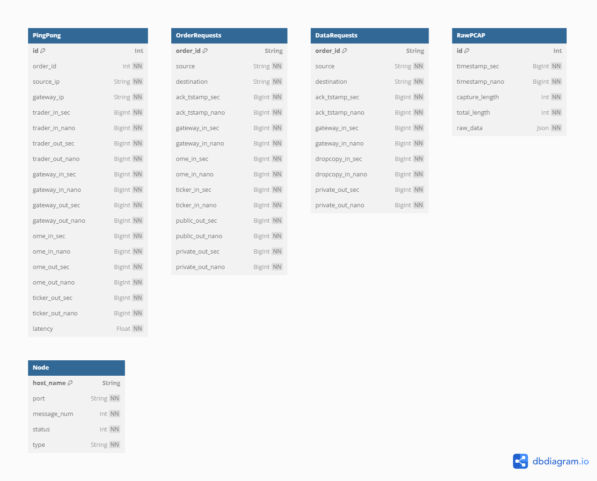
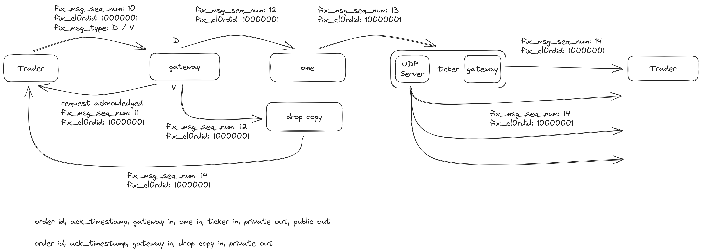

# G4 Netcap Final Report

## Application Service Report (Adrian Cheng)

### Design Goals

The initial goal set out for this project is to create a web application, similar to corvil, in which we can see real time latency statistics from packets generated from trading activity. To achieve this, we have decided that it is important for us to create a realistic trading environment to more accurately grasp the different aspects and latency analytics that can be derived from a real trading environment.

### Application Frontend

The whole frontend interface of this project is built in typescript, on top of the React.js framework. This is coupled with integrations with several other libraries to manage the different states and connections that the different pages would need to execute upon such as Jotai for state management, Socketio for websockets, TailwindCSS for styling, and several others.

The core of the front end is split up into two main panels, one is the navigation panel and the other is the main screen. When first opening up the website, you will be greeted with the main dashboard:

_Note: If no previous trading simulation has been ran, this screen may be blank. Simply start up a exchange trader network to view the graph of your network in the dashboard._

The next page you can access when the trading simulation is running is the latency analytics page. In this page, you will be able to add and remove charts as needed, and to adjust each of the charts to display an assortment of data, including both running averages of the current latencies of packets, as well as the latency distribution histogram as shown below:

The third page you can access is the order explorer. Within the order explorer, you can browse through specific market order requests, or market data requests being sent within the trading simulation. You can then click on each request to view specific timing information regarding that specific request. Both absolute and relative timing information are in nanoseconds (ns). The relative timing information is based on when the request is first received within the exchange gateway, whilst the absolute timing information is the ns since epoch:

Finally, the last page, PCAP explorer, is the page where you can view the individual raw packets that are actually being sent throughout the simulated trading network. By clicking on a certain packet, you can see the raw data within the packet, as well as the ascii representation of the packet. To the leftmost side, you will see the parsed packet information regarding the packet:

### Application Backend

The backend of the web application is based on the Nestjs framework. This backend not only provides the interface between the frontend and our MySQL database, but also serves as a communication hub between all of the nodes within the trade network, this includes all exchanges, traders, and packet capturing processes. The nest backend is the socketio server, in which the other trading simulation nodes would connect to as clients. This how we can achieve real time data analytics as the packets get recorded and sent to the database.

As for our database, we mainly use Prisma to help keep version control of our database layout. The following is the different tables we have layed out within our MySQL database:

In the final build of this project, only the tables `OrderRequests`, `DataRequests`, and `RawPCAP` are actually being used. The `PingPong` and `Node` tables were used in a previous version of this app, however, since we needed to change the way we are recording latency information from just doing internal metrics through a trace packet, the legacy tables `PingPong` and `Node` are deprecated.

### Simulated Exchange

Within the simulated exchange does 2 very important steps. The first step is to respond to any trade requests being sent from a trader in a realistic manner, while the second step is to record every packet being sent to and from, and any internally sent packets for latency evaluation. Within each exchange is an actual internalized network, with several components at play:

What this diagram shows is the flow of packets from when the trader first sends to the exchange to when the exchange finally sends the response back to the trader. The packet initally enters the gateway of the exchange, which then deciphers whether the packet is a order request or a market data request.

If the packet is to be determined as an order request, it would then be forwarded to the order matching engine (OME). Once the packet has been received within the OME, a response would be generated, then sent to the ticker plant. The ticker plant would then perform two actions once the packet has been received. The first thing it does is to send it to an internal UDP server to broadcast the response out to every trader on the network. Simultaneously, the ticker would also connect back to the original gateway in which the trader has initially communicated with and send the response back privately to the original sender. Due to the speed differences between UDP and TCP protocols, the UDP broadcast will always be received first by the traders, compared to the private data feed.

On the other hand, if a market data request is to be sent, the gateway would route that packet towards the drop copy, in which the drop copy would generate a market data response which would be sent through the original gateway back to the trader.

### Packet Capturing

Within each exchange lies a custom packet sniffing program. This program would capture all inbound and outbound packet traffic regarding any trading activities. The sniffer would then take the packets and parse them to the individual components which would then be sent to the MySQL database directly, directly to the RawPCAP table. This packet capturing program has been configured to have nanosecond precision allowing for all the nanosecond timestamps available within the frontend. The capturing program itself is written in C, mainly utilizing the libpcap library to capture the individual packets then parsing them to a JSON format.

### Simulated Trader

The simulated trader is probably the simplest component of the simulated trading network. The trader simply generates randomized trading requests, at a ratio of 5 orders per 1 market data request. The trader will also randomly send these packets to all available exchanges at random intervals, thus allowing the exchange packet capturing to collect a more comprehensive view on the latency activity of the whole simulated trading network.

### Main Challenges

Some of the main challenges that we had in creating the application was in regards to capturing the latency data. In the first iteration, what we had done is to essentially have a trace packet being sent from the traders, and once the exchange had received the packet, would randomly generate delays onto the trace packet which would then be sent back to the trader. However, this was an unreliable and unrealistic way of accurately capturing the timestamps of the packets, since we aren't actually sending any physical packets around and within the exchange. We had to pivot and drastically change our backend, exchange, trader, and packet capturing services in order to accomodate the new plan described above.

## Backend Service Report (Zijing Wei)

### Introduction of the Backend

The backend VM focuses on real-time analysis of trading system latency. It handles and analyzes network data to measure and visualize the latency of various components in the exchange. The backend can be divided into three parts:

- Database
- API & Services
- Real-time Analysis (WebSocket)

### Core Functionalities

#### Prisma (Database Client)

The Prisma database client aids in the storage of captured network data.

- OrderRequests: Logs specific timestamps of an order request as it transitions through diverse components.

  - order_id: Unique order identifier.
  - source & destination: Denote the initiation and - termination points of the request.
  - Time-stamps for ack, gateway_in, ome_in, ticker_in, public_out, and private_out (both in seconds & nanoseconds).

- DataRequests: Structure similar to OrderRequests but with supplementary time-stamps for dropcopy_in.

- RawPCAP: Maintains the raw packet capture data.

  - timestamp_sec & timestamp_nano: Pinpoint the exact time of packet capture.
  - capture_length & total_length: Details about the packet size.
  - raw_data: JSON formatted representation of the raw data.

- Node: Network nodes.

  - host_name: Host designation.
  - port: Active port number.
  - message_num: Count of messages processed.
  - status: Current operational state of the node.
  - type: Classifies the node (examples include trader, gateway, ticker plant).

#### API & Services

- General Prisma Services: These services facilitate CRUD operations on their affiliated data models such as Node, RawPCAP, OrderRequest, DataRequest, and so on.

- RawPCAP Service: Deployed within the WebSocket gateway, this service delves into the raw packet capture (PCAP) data for latency metric extraction. It offers the following detailed analysis:

  - Average Latency of the trading system.
  - Average Latency of each exchange component.
  - Average Latency of components, grouped by host name.
  - "Live" value analysis

#### Real-time Analysis (WebSocket)

WebSockets enrich the backend, granting the frontend VM real-time analytical data. This ensures the frontend is consistently updated without the necessity for manual reloads. In the process, the RawPCAP service is invoked to obtain the analytical findings which are subsequently relayed to the frontend.

#### Success & Challenges

In our initial setup, we aimed to analyze trading system latency using a basic "PingPong" database, and simulating random data without representing specific components of the trading machine. However, as we dove deeper, we realized the need for a more detailed simulation that captured the actual behaviors and latencies between trading components. This led us to introduce the `RawPcap` structure to store raw data. As a result, the backend's complexity grew significantly, requiring a complete rewrite to accommodate the processing of raw data and its storage into tables like `DataRequest` and `OrderRequest`. This shift from a simple to a comprehensive backend allowed us to capture and analyze real-world trading latency more effectively.

## Trace Packet and Trader Service Report (Yunfan Hu)

### Core Features

#### 1. Trader Trace Packet Generations (not used in final version)

Generates trace packets with unique `order_id`s and various other details such as source and gateway IP addresses, and then encode the packet to string.

#### 2. Packets Receiving and Processing (not used in final version)

Through a separate thread listens for incoming packet, updating `trader_in` timestamp and calculating the latency before forwarding the updated packet data to an API for storage and analysis.

#### 3. API Communications

The processed data is sent to a predefined API endpoint using the POST method, where it can be stored in a database for further analysis and reporting.

#### 4. Trader Message Generations

This script simulates a random FIX client that sends and receives FIX messages for market data and new order executions. It generates random new order and market data request messages, sends them to a specified exchange server, and handles the responses.

#### 5. TCPDump Implementations (not used in final version)

By using `tcpdump`, filters for specific packets sent between an exchange and a client, and calculates the latency. The script then sends this data to a backend server using an API.

### Initial Successes

#### 1. Live Data Parsing

Successfully implemented real-time data parsing from live tcpdump output, thus facilitating immediate insights into network communications.

#### 2. High-Precision Time-Stamping

Achieved nanosecond precision in timestamping, enhancing the accuracy of latency calculations.

#### 3. Robust Packet Generation

The `generate_trace_packet` function successfully creates packets with necessary details, facilitating the traceability of each packet through its unique order ID and source and gateway IPs.

#### 4. Efficient Multi-threading

Successfully implemented a multi-threaded solution, allowing for simultaneous handling of multiple exchange connections and optimizing the program for performance.

### Bugs Overcome

#### 1. Latency Calculations

In tcpdump, I met issues of wrong latecny calculated since I used wrong regular expressions to extract timestamps from each line of output and only calculates latency based on the time difference between a ping and the subsequent pong. This lead to the bug because Many orders is not closed immediately and I calculate the latency based on wrong packet.

#### 2. FIX Message Integration

Initially, the FIX messages were not being captured in the tcpdump output. I adjusted the tcpdump command to include the `-A` option, which ensured that the payload of the packets was printed in ASCII, enabling the extraction of FIX messages and, consequently, the order ID.

#### 3. Database Compatibility

Initially, I got issues with data type mismatches with the database, leading to failure of streaming time data to the database. The final script converts numerical values to strings to ensure compatibility with the database's expectations, thereby resolving the issue.

## Exchange and FIX Parser Service Report (Batuhan Usluel)

### Core Features

#### 1. Multi-Client Exchange Handling

Created a simulated exchange that could connect to any number of clients and respond to their FIX messages.

#### 2. Realistic random delay

Implemented a feature used to randomize the delays of each component. Instead of having the delays completely random, it is trending meaning average latency can go up or down over time.

#### 3. Message timestamping

The exhange adds timestamps to the messsage generated by the realistic random delay for the Gateway, OME, and tickerplant. Once the message is timestamped it responds back to the client.

#### 4. VM/Provision scripts/Config

Helped with initial setup of the vm/provision scripts, such as installing python & pip packages on them. Also with having variables such as IP's be enviornment variables instead of hardcoded.

### Challenges Overcome

#### 1. Virtual Machine Setup

We faced some initial problems with packages being installed on VMs, for both Python and node.

#### 2. Changing designs

We changed up how we wanted things done a few times, such as the decision for using FIX or not, whether to have a single exchange that simulates all components or create a fully seperate gateway, ticker plant, etc.
